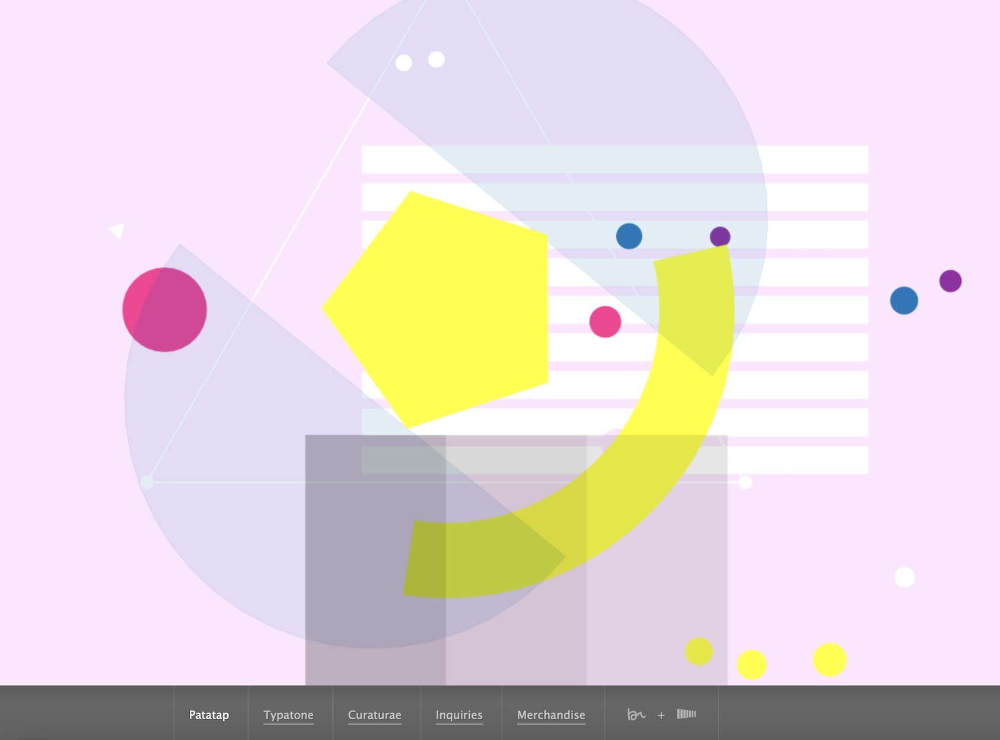

# jtan0662_9103_tut02
My first repository for IDEA9103

# Quiz 8
## Part 1: Imaging Technique Inspiration
I got inspirations from the project “Patatap”.
[link for the project](https://www.patatap.com)
This project allows users to generate dynamic geometric shapes in response to their input, accompanied by sound effects.

I am inspired by the sound changes aligned with user input in this project. I would like to incorporate a similar imaging technique into my project. While the intial lines and shapes are flowing, users can generate visual changes through clicks or key presses while composing their own unique “music,”. In that case, it would be more playful.

## Part 2: Coding Technique Exploration
Using p5.js’s sound library (such as p5.Sound), I can make user inputs (such as key presses or mouse clicks) generate both geometric shapes and corresponding sounds.
[Sound Example link](https://archive.p5js.org/reference/#/p5.SoundFile)
I plan to use the keyPressed() and mousePressed() functions to capture user interactions and combine them with sound generation functions, ensuring that each visual change is accompanied by a different sound effect.
[Initial Flow shpes Example link](https://p5js.org/examples//animation-and-variables-animation-with-events/)